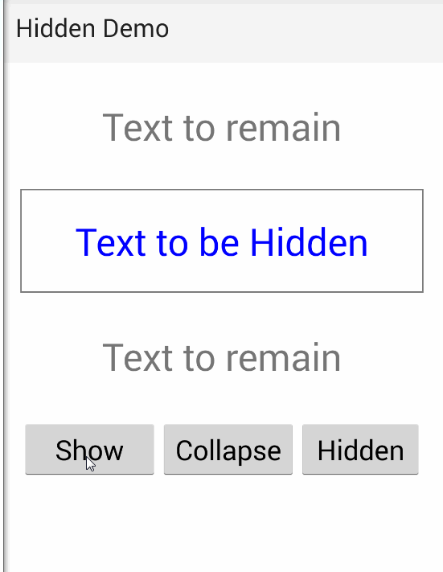

[](https://www.npmjs.com/package/nativescript-hidden)
[](https://www.npmjs.com/package/nativescript-hidden)
[](https://www.npmjs.com/package/nativescript-hidden)

# Nativescript-Hidden
A NativeScript plugin to deal with hidding elements without affecting the layout flow 

**WARNING:** The code is NOT "officially" on NPM yet, the code/plugin is available to Patreon supporters or purchasable via 
[http://nativescript.tools](http://nativescript.tools/all)

THIS is on NPM to be used as a Placeholder so that this plugin does have a home when(if?) it is ever released open source.

## License

The actual code is released under what I call the PATRON License, meaning you are free to include this in any type of program as long as you downloaded this when you were a current multi-month patron/sponsor, and got the file directly from the patreon post.  

Depending on the support of the plugin from Patron's -- it may be released under a proper open source license at a time of my choosing (typically after a couple months of exclusive access by sponsor's).  At that point the product will be re-released under the MIT license. 

In addition to the PATRON license, you can purchase this directly under a COMMERCIAL license from the [http://nativescript.tools](http://nativescript.tools/all) site.
 

I also do contract work; so if you have a module you want built for NativeScript (or any other software projects) feel free to contact me [nathan@master-technology.com](mailto://nathan@master-technology.com).

[](https://www.paypal.com/cgi-bin/webscr?cmd=_donations&business=HN8DDMWVGBNQL&lc=US&item_name=Nathanael%20Anderson&item_number=nativescript%2dhidden&no_note=1&no_shipping=1&currency_code=USD&bn=PP%2dDonationsBF%3ax%3aNonHosted)
[](https://www.patreon.com/NathanaelA)


## Sample Snapshot



## Requirements
This requires NativeScript 2.0 or greater

## Installation 

`tns plugin add nativescript-hidden`


## Usage

To activate globally in your app.js/app.ts file just add:

```js
require( "nativescript-hidden" );
```


## Why use this?
NativeScript has a built in visibility collapsed; but the collapsed causes the entire display to change.
This plugin adds a new **visibility: hidden** which allows the space to be used by the object; just hidden.


## Example
Example is using the [Nativescript-Dom](http://github.com/NathanaelA/NativeScript-dom) helpers.


Some CSS:
```
.hidden {
   visibility: hidden;
}
```

Some JS:
```
var item = getElementById('someElement');
item.classList.toggle('hidden',true);
```
